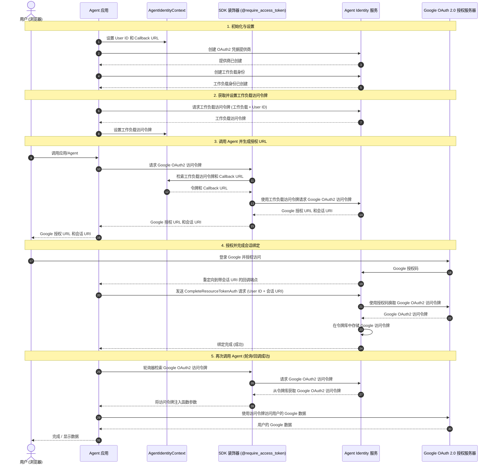
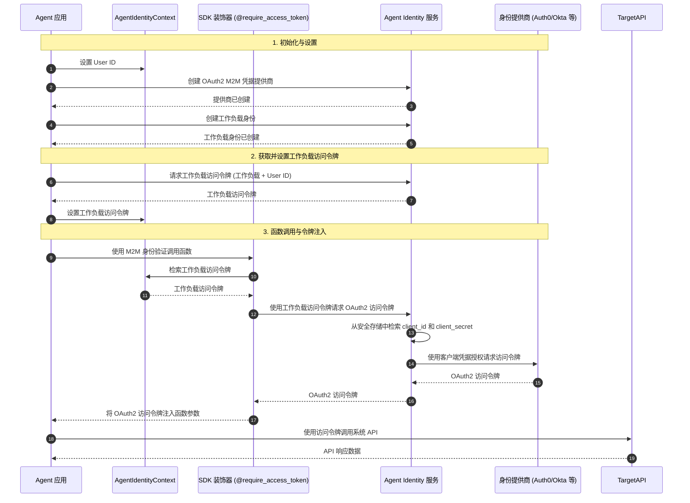
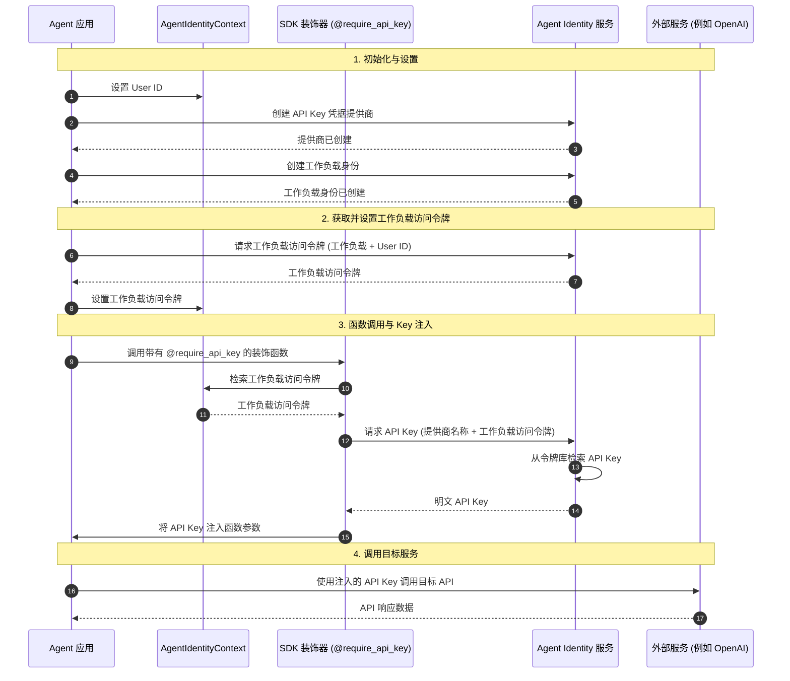
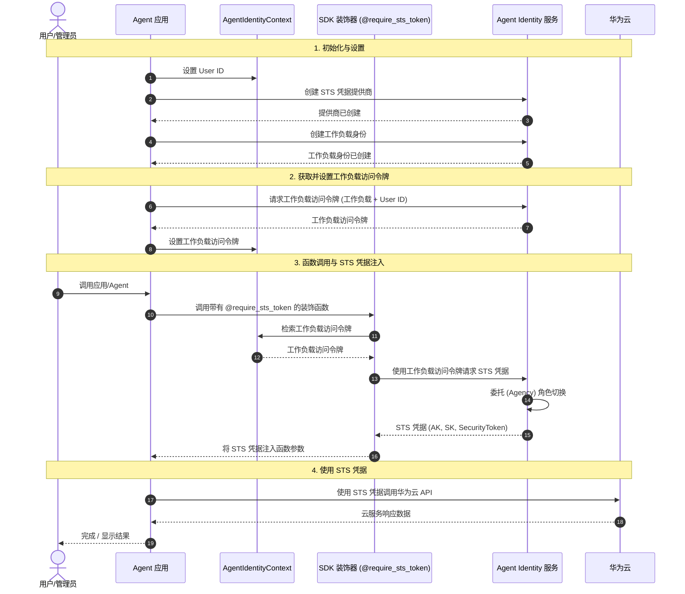

# Agent Identity Development SDK

一个旨在简化 AI Agent 的 OAuth2.0 和 API Key 管理的 Python SDK。该 SDK 提供了易于使用的装饰器和高级客户端，用于处理凭据获取、会话绑定和令牌轮询。

## 特性

- **简化身份验证：** 使用装饰器自动将 OAuth2 令牌和 API Key 注入到你的函数中。
- **双重支持：** 无缝支持同步和异步 Python 函数。
- **会话绑定：** 支持 Agent 的“授权 URL 会话绑定”流程。
- **本地开发：** 通过 `.agent_identity.json` 自动处理本地身份配置。
- **灵活轮询：** 内置用户授权完成的轮询机制。

## 前提条件

在使用 OAuth2 流程之前，请确保你已配置：

1. **回调 URL**：对于 USER_FEDERATION 流程，请在你的身份提供商中配置重定向 URI。
2. **允许的资源 OAuth2 返回 URL (Allowed Resource OAuth2 Return URL)**：对于 USER_FEDERATION 流程，在华为云控制台的工作负载身份中白名单化该回调
   URL。
3. **Client ID 和 Client Secret**：由你的身份提供商（如 Auth0、Okta 等）颁发，并在华为云控制台中进行配置。

这些配置在**华为云控制台**的“**Agent Identity > 凭据提供商**”下进行管理。你的代码只需引用 `provider_name`
，而服务将处理安全的凭据存储和令牌交换。

## 工作原理

SDK 支持多种身份验证流程，以适应不同的资源提供商。

### OAuth2 流程

下图展示了使用 Agent Identity SDK 的 OAuth2 流程：



### OAuth2 M2M (机器对机器) 流程

下图展示了使用 Agent Identity SDK 的 OAuth2 M2M（客户端凭据授权）流程：



### API Key 流程

下图展示了 API Key 获取流程：



### STS Token 流程

下图展示了 STS Token 获取流程（例如华为云 IAM）：



## 安装

使用 `pip` 安装 SDK：

```bash
pip install agent-identity-dev-sdk
```

或者如果你正在使用 `uv`：

```bash
uv add agent-identity-dev-sdk
```

## 快速入门

### 1. 配置华为云 Union SDK

本 SDK 依赖于华为云 Union SDK。你必须配置以下环境变量以通过华为云服务进行身份验证：

```bash
export HUAWEICLOUD_SDK_AK="your-access-key"
export HUAWEICLOUD_SDK_SK="your-secret-key"
export HUAWEICLOUD_SDK_PROJECT_ID="your-project-id"
export HUAWEICLOUD_SDK_REGION="cn-north-4"
export HUAWEICLOUD_SDK_DOMAIN_ID="your-domain-id"
```

#### 自定义服务终端节点 (Endpoint)

您可以使用遵循 `HUAWEICLOUD_SDK_REGION_AGENTIDENTITY_{REGION_ID}={endpoint}` 模式的环境变量来自定义特定区域的 Agent
Identity 服务终端节点。

例如：

```bash
# 自定义 cn-southwest-301 区域的终端节点
export HUAWEICLOUD_SDK_REGION_AGENTIDENTITY_CN_SOUTHWEST_301="https://agent-identity-open.cn-southwest-301.beta.myhuaweicloud.com"
```

### 2. 使用装饰器

推荐使用装饰器来处理凭据生命周期。它们会自动将令牌或密钥注入到你的函数参数中。

```python
from typing import Optional
from agentarts.sdk import require_access_token, require_api_key, require_sts_token
from agentarts.sdk.identity.types import StsCredentials


# OAuth2 Access Token 注入 (异步)
@require_access_token(
    provider_name="google",
    scopes=["https://www.googleapis.com/auth/userinfo.email"],
    auth_flow="USER_FEDERATION"
)
async def fetch_google_data(access_token: Optional[str] = None):
    print(f"Using OAuth2 token: {access_token}")


# M2M Access Token 注入 (异步)
@require_access_token(
    provider_name="my-company-api",
    auth_flow="M2M"
)
async def call_internal_service(access_token: Optional[str] = None):
    print(f"Using M2M OAuth2 token: {access_token}")


# API Key 注入 (同步)
@require_api_key(provider_name="openai")
def call_llm(api_key: Optional[str] = None):
    print(f"Using API Key: {api_key}")


# STS Token 注入
@require_sts_token(provider_name="huaweicloud-iam", agency_session_name="example-session")
async def access_huawei_resource(sts_credentials: Optional[StsCredentials] = None):
    # 直接访问 SDK 对象字段
    print(f"AK: {sts_credentials.access_key_id}")
    print(f"SK: {sts_credentials.secret_access_key}")
    print(f"SecurityToken: {sts_credentials.security_token}")
```

### 3. 使用 IdentityClient

使用 `IdentityClient` 进行手动控制，例如在 Web 回调中完成会话绑定。

```python
from agentarts.sdk import IdentityClient
from huaweicloudsdkagentidentity.v1.model import UserIdentifier

client = IdentityClient(region="cn-north-4")

# 手动获取令牌
token = await client.get_resource_oauth2_token(
    provider_name="google",
    scopes=["..."],
    workload_access_token="...",
    auth_flow="USER_FEDERATION"
)

# 手动获取 STS 凭据
sts_credentials = client.get_resource_sts_token(
    provider_name="huaweicloud-iam",
    workload_access_token="...",
    agency_session_name="my-session"
)

# 完成会话绑定 (3LO 流程)
user_identifier = UserIdentifier(user_id="user-123")
client.complete_resource_token_auth(
    session_uri="urn:uuid:...",
    user_identifier=user_identifier
)
```

### 4. 使用 AgentIdentityContext

`AgentIdentityContext` 管理当前请求的执行上下文，例如当前用户 ID 或回调 URL。

```python
from agentarts.sdk import AgentArtsRuntimeContext

# 在调用装饰函数之前设置上下文
AgentArtsRuntimeContext.set_user_id("user-123")
AgentArtsRuntimeContext.set_oauth2_callback_url("https://yourapp.com/callback")
AgentArtsRuntimeContext.set_oauth2_custom_state("session-uuid-123")

# 从上下文中检索值
current_user = AgentArtsRuntimeContext.get_user_id()
```

## 示例

查看 `examples/` 目录以获取完整的应用模板：

- **[Basic SDK Usage](examples/basic_sdk_usage/):** 模块化示例，演示了 OAuth2、API Key、STS Token 以及手动客户端用法。

要使用 Jupyter 交互式运行示例：

```bash
uv run jupyter lab
```

或在 VS Code 等 IDE 中直接打开 `.ipynb` 文件。

## 开发

### 设置

本项目组织为 **uv workspace**。要设置包含所有示例的开发环境：

```bash
# 克隆仓库
git clone <repository-url>
cd agent-identity-dev-sdk

# 安装所有依赖（包括示例）
uv sync --all-packages
```

### 构建

要构建项目并生成分发文件（包括 `.whl` 文件）：

```bash
# 同时构建源码包和 wheel 包
uv build

# 仅构建 wheel 包
uv build --wheel
```

构建产物将位于 `dist/` 目录中。

### 运行测试

```bash
uv run pytest
```

### 格式化与 Lint

```bash
uv run ruff format .
uv run ruff check .
```

### 类型检查

```bash
uv run ty
```

### 文档

本地预览文档（支持中英文切换）：

```bash
uv run mkdocs serve
```

构建静态文档网站：

```bash
uv run mkdocs build
```

## 项目结构

- `src/agent_identity_dev_sdk/`: 核心库源代码。
    - `services/`: 身份和令牌轮询实现。
    - `runtime/`: 执行上下文和辅助工具。
- `tests/`: 完整的测试套件。
- `examples/`: 使用示例和模板。
